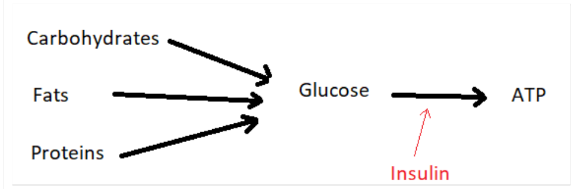

# DAAN572 Reinforcement Learning Final Project

This project develops a REINFORCE algorithm in a simulated metabolic environments of diabetic individuals, provided by the Simglucose module (https://github.com/jxx123/simglucose), for an agent that controls an insulin pump. 

## Background
The human metabolic system converts calories from food to a fuel, typically adinotriphosphate (ATP), which is used to power cells. In a simple sense, calories from carbs, fats, and proteins are converted to glucose, which is then combined with insulin and converted to ATP, which is then converted to movement or some other bodily function. The entire process involves many other bodily systems, and also involves the conversion of glucose to glucagon for use later, but the fundamental picture looks something like this:

# RL Problem Characterization

## Environment 
A simulated one-day time period for 30 virtual diabetic adult and adolescent individuals. Each individual will eat scheduled meals and will have varied responses to the introduction of glucose and insulin. If a patient’s blood glucose goes into a failure state, they would receive instruction to eat food or manually inject insulin themselves. This environment may be characterized as a finite Markov Decision Process (MDP).

## States
Blood Glucose (measured as milligrams per deciliter mg/dl), represented as a continuous value with a clinically detectable range of 0 to 600 and is read from a Continuous Glucose Monitor (CGM) every 3 minutes. Healthy glucose levels are between 60 and 120. If the most recent glucose reading is below 50 or above 400 this may be considered a failure state. 

## Actions
The agent will have the ability to introduce between 0 and 30 units of basal insulin to the blood stream through an implanted device with the level of injected insulin determined about every three minutes when the CGM returns a reading.

## Rewards
The relative change in value of the Blood Glucose Risk Index (BGRI) as defined by Statistical Tools to Analyze Continuous Glucose Monitor Data (Clarke 2009). 

## Policy
The policy as a PyTorch Neural Network (weights saved to /cont_policy_net3) and was trained on Adolescent #001 with about 400 trajectories. The code was developed and the policy was trained in a scratchwork Jupyter notebook, train_and_test.ipynb, and evaluated using a separate notebook policy_eval.ipynb. 

## Discussion
The original intention was to have patients eat meals at random, however, this proved to be too ambitious for this algorithm and perhaps too ambitious for any agent in this environment. It would take roughly 1 hour for BG to peak after a meal and, if a meal was large, if insulin was not administered correctly at meal time then it was essentially too late for the agent to recover and prevent going into a high failure state. If the agent waited too long and administered a large bolus after a meal, then this would lead to a low BG failure state following the BG post-meal peak. Given this delicate balance requirement, completely random meal times interupt the planning the agent tries to perform. If random meals, then the agent has a tendency to administer a basal insulin that's too high (anticipating a meal at any time) but this was just as likely to cause low BG failure. Therefore, the submitted project used scheduled meals. It would be interesting to investigate partially random meals that have slightly varied calorie amounts and slightly varied times.

A second deviation from the original project intention was that the trained poilicy was only applied to one simulated individual. If the policy is used on other individuals it has the behavior of over-correcting for children and undercorrecting for adults. This should be interpreted as a trained policy is specifically tailored for an individual.
